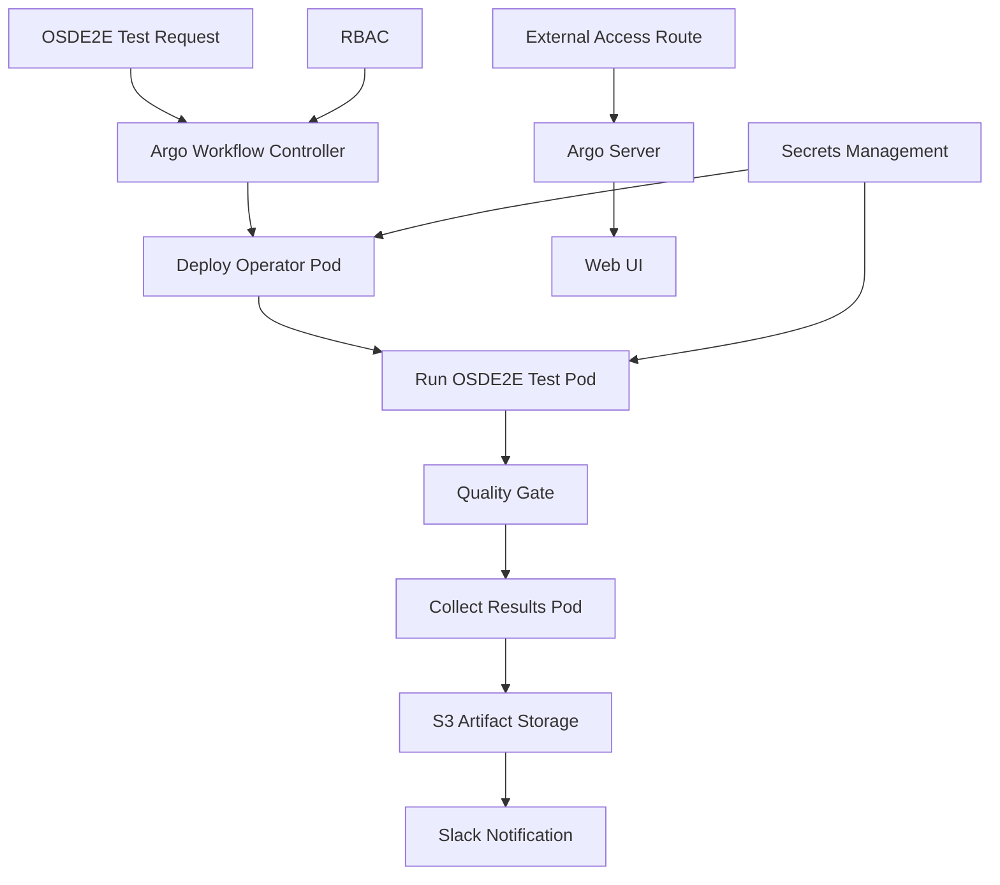

# Argo Workflows OSDE2E Architecture Deep Dive

**Complete architectural analysis of our Argo Workflows OSDE2E implementation**

## Architecture Overview

Our Argo Workflows OSDE2E implementation is a multi-layered, production-grade automated testing system consisting of the following core components:

### System Architecture



## Core Components Analysis

### 1. Argo Workflows Core

#### Workflow Controller
- Manages workflow lifecycle
- Coordinates pod creation and execution
- Handles artifact uploads to S3
- Manages workflow state transitions

#### Argo Server
- Provides REST API interface
- Serves Web UI
- Handles external access requests
- Manages authentication and authorization

### 2. RBAC Security Architecture

#### Permission Hierarchy
- **ServiceAccount**: `osde2e-workflow`
- **ClusterRole**: `osde2e-workflow`
- **ClusterRoleBinding**: Links ServiceAccount to ClusterRole

#### Permission Matrix

| Resource Type | Operations | Scope | Purpose |
|--------------|------------|-------|---------|
| **Pods** | get, list, watch, create, delete | Cluster | Manage test and operator pods |
| **Namespaces** | get, list, create, update, patch, delete | Cluster | Create isolated test environments |
| **ServiceAccounts** | get, list, create, update, patch, delete | Cluster | Create operator identities |
| **ClusterRoles/ClusterRoleBindings** | get, list, create, update, patch, delete | Cluster | Configure operator RBAC |
| **CustomResourceDefinitions** | get, list, watch, create, update, patch, delete | Cluster | Install operator CRDs |
| **Deployments** | get, list, create, update, patch, delete, watch | Cluster | Deploy and manage operators |
| **managed.openshift.io*** | get, list, watch, create, update, patch, delete | Cluster | Operate custom resources |

### 3. Credential Management Architecture

#### Credential Segregation Strategy
- **Local Development**: `secrets-local.yaml` (gitignored)
- **Production**: Kubernetes secrets with proper RBAC
- **Separation**: Configuration files contain no credentials

#### Credential Usage Flow
1. Secrets mounted as environment variables
2. AWS credentials configured via init containers
3. OCM credentials used for cluster access
4. Slack webhooks for notifications

### 4. S3 Artifact Repository Architecture

#### Storage Hierarchy
```
s3://osde2e-test-artifacts/
└── workflows/
    └── {operator-name}/
        └── {cluster-id}/
            └── {timestamp}/
                ├── argo-logs/           # Workflow step logs
                ├── artifacts/           # Test outputs
                ├── test-summary.json    # Results summary
                └── test-report.html     # Formatted report
```

#### Artifact Lifecycle Management
- **Creation**: Generated during workflow execution
- **Storage**: Uploaded to S3 with deterministic paths
- **Access**: Direct browser-accessible URLs
- **Retention**: Configurable lifecycle policies

## OSDE2E Test Results Storage

### Overview

Before Argo Workflows integration, OSDE2E test results were stored and managed through local filesystem methods. This section explains the historical context and current implementation.

### Historical Storage (Before Argo Workflows)

#### Local Storage Directories
- **Default Report Directory**: Configured via `REPORT_DIR` or `ARTIFACTS` environment variables
- **Temporary Directory**: Uses `/tmp/osde2e-{random}` if `REPORT_DIR` is not set
- **Test Container**: `/test-run-results` (DefaultRunner.OutputDir)

#### Directory Structure
```
${REPORT_DIR}/
├── install/                    # Installation phase test results
│   ├── junit_install.xml      # JUnit XML reports
│   ├── test_output.log        # Test execution logs
│   └── artifacts/             # Other test artifacts
├── upgrade/                   # Upgrade phase test results
│   ├── junit_upgrade.xml      # JUnit XML reports
│   └── ...
├── must-gather/               # Cluster diagnostic data
└── shared/                    # Shared files directory
```

### JUnit Report Format

#### File Naming Convention
- **Format**: `junit_{suffix}.xml`
- **Examples**: `junit_install.xml`, `junit_upgrade.xml`
- **Operator Tests**: `junit-osd-example-operator.xml`

#### JUnit XML Structure
```xml
<?xml version="1.0" encoding="UTF-8"?>
<testsuite name="OSDE2E" tests="10" failures="0" errors="0" time="120.5">
  <testcase classname="Install" name="operator deployment" time="30.2">
    <system-out>Test output...</system-out>
  </testcase>
  <testcase classname="Upgrade" name="operator upgrade" time="45.1">
    <failure message="Upgrade failed">Error details...</failure>
  </testcase>
</testsuite>
```

### Test Result File Types

#### Core Files
1. **JUnit XML Reports** (`junit_*.xml`)
   - Standard JUnit format
   - Contains test cases, status, and execution time
   - Used for CI/CD integration and result parsing

2. **Test Output Logs** (`test_output.log`)
   - Complete test execution logs
   - Contains detailed error information and debug output

3. **Must-Gather Data** (`must-gather/`)
   - Cluster diagnostic information
   - System logs and resource states
   - Used for troubleshooting test failures

4. **Test Artifacts** (`artifacts/`)
   - Screenshots, configuration files
   - Custom test outputs
   - Environment-specific data

### Current Implementation (Argo Workflows)

#### Unified S3 Storage Structure
```
S3 Bucket: osde2e-test-artifacts
└── workflows/
    └── {operator-name}/
        └── {cluster-id}/
            └── {timestamp}/
                ├── argo-logs/                   # Workflow step logs
                │   ├── workflow-deploy-operator/main.log
                │   ├── workflow-run-osde2e-test/main.log
                │   └── workflow-collect-results/main.log
                ├── artifacts/                   # Test outputs
                │   ├── osde2e-reports.tar.gz    # Complete archive
                │   ├── main_execution.log       # Full execution log
                │   └── test_output.log          # OSDE2E internal log
                ├── test-summary.json            # Test metadata
                └── test-report.html             # Formatted report
```

### Migration Benefits

| Aspect | Before Argo Workflows | After Argo Workflows |
|--------|----------------------|----------------------|
| **Storage** | Local filesystem | AWS S3 |
| **Access** | Direct file access | Web UI + S3 URLs |
| **Retention** | Manual cleanup | Automated policies |
| **Sharing** | File copying | Shareable URLs |
| **Integration** | Limited | Full CI/CD support |
| **Scalability** | Local disk limits | Cloud storage |
| **Collaboration** | Difficult | Easy team sharing |

The migration to Argo Workflows has significantly improved test result accessibility, persistence, and team collaboration while maintaining all the original functionality of local OSDE2E test execution.

---

**This architecture deep-dive document provides a complete technical view of the Argo Workflows OSDE2E implementation, covering everything from core components to scalability considerations and test result management.**
