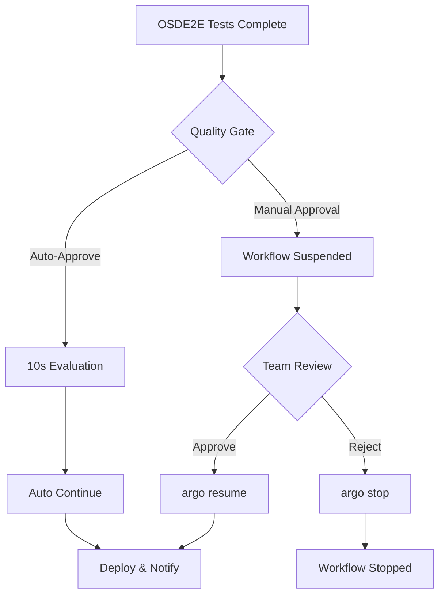

# Quality Gates Guide

## Overview

Quality gates provide checkpoints in the OSDE2E testing workflow, ensuring only validated operators proceed to production deployment.

## Gate Modes

| Mode | Command | Behavior | Use Case |
|------|---------|----------|----------|
| **Auto-Approve** | `./run.sh` | 10s evaluation → auto-continue | CI/CD pipelines |
| **Manual Approval** | `./run.sh --manual-approval` | Pauses for human review | Production deployments |

## Usage

### Auto-Approve Mode (Default)
```bash
./run.sh
```

**Flow**:
1. Tests complete
2. Gate evaluates for 10 seconds
3. Automatically approves
4. Workflow continues to deployment

### Manual Approval Mode
```bash
./run.sh --manual-approval
```

**Flow**:
1. Tests complete
2. Workflow **pauses** at quality gate
3. Team reviews test results
4. Manual decision required:
   ```bash
   # To approve and continue
   argo resume <workflow-name> -n argo

   # To reject and stop
   argo stop <workflow-name> -n argo
   ```

## Quality Gate Workflow



## Integration Benefits

### For CI/CD Pipelines
- **Automated Quality Checks**: Auto-approve mode for continuous integration
- **Audit Trail**: All decisions logged in Argo Workflows
- **Artifact Storage**: Test results preserved in S3

### For Production Deployments
- **Human Oversight**: Manual review of critical deployments
- **Team Collaboration**: Shared decision-making process
- **Risk Mitigation**: Prevent faulty deployments

## Monitoring & Observability

### Argo UI
- Visual workflow representation
- Real-time gate status
- Historical execution logs

### Slack Notifications
- Test completion alerts
- Approval/rejection notifications
- Direct links to test results

### S3 Artifacts
- Complete test logs
- JUnit XML reports
- HTML formatted results

## Best Practices

### When to Use Auto-Approve
- Development environments
- Non-critical deployments
- Automated CI/CD pipelines
- Regression testing

### When to Use Manual Approval
- Production deployments
- Critical operator updates
- Security-sensitive changes
- Compliance requirements

## Troubleshooting

| Issue | Solution |
|-------|----------|
| Gate not pausing | Verify `--manual-approval` flag |
| Cannot resume workflow | Check workflow name and namespace |
| Missing test results | Review OSDE2E execution logs |
| Workflow stuck | Use `argo get <workflow-name>` to diagnose |

---

**Next**: See [DEMO.md](DEMO.md) for hands-on demonstration of quality gates.
