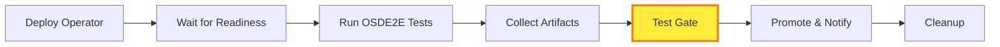

# OSDE2E Test Gate with Argo Workflows

OSDE2E test gates using Argo Workflows for automated operator testing and deployment validation. This system provides production-ready quality gates with comprehensive security, monitoring, and CI/CD integration capabilities.

## Overview

This system provides a comprehensive automated test gate that validates your operators before production deployment:

- **Automated Testing**: Runs OSDE2E tests on existing OpenShift clusters using your test harness
- **Quick Setup**: One-command setup with `./setup.sh` or step-by-step manual configuration
- **CI/CD Integration**: Acts as a reliable gate for GitLab CI, GitHub Actions, and other pipelines
- **Rich Notifications**: Sends detailed Slack notifications with test results, links, and status
- **Production Ready**: Includes RBAC, secrets management, and comprehensive error handling

## Repository Structure

```
deploy/argo-workflows/
 README.md                      # This comprehensive guide
 osde2e-workflow.yaml           # Main WorkflowTemplate
 secrets.yaml                   # Credentials template
 rbac.yaml                      # RBAC permissions
 setup.sh                       # Automated setup script
 run.sh                         # Test runner with quality gates
 ui.sh                          # UI access management
 s3-artifact-config.yaml        # S3 artifact repository config
 setup-s3-artifacts.sh          # S3 setup automation
 setup-external-access.sh       # External UI access setup
 QUALITY-GATES.md               # Quality gate modes and usage
 S3-ARTIFACT-SETUP.md           # S3 setup documentation
 TROUBLESHOOTING.md             # Comprehensive troubleshooting guide
 ARCHITECTURE-DEEP-DIVE.md      # Technical architecture details & test results
 .gitignore                     # Git ignore rules
```

## Quick Start

### Prerequisites

Ensure you have the following before starting:

| Requirement | Description | Status |
|-------------|-------------|---------|
| **Kubernetes Cluster** | OpenShift cluster with admin access | Required |
| **kubectl CLI** | Configured and connected to your cluster | Required |
| **Argo Workflows** | Installed on the cluster | Auto-installed |
| **Argo CLI** | [Installation Guide](https://argoproj.github.io/argo-workflows/cli/) | Optional |
| **Credentials** | OCM + AWS credentials from vault | Required |
| **Test Image** | Your operator E2E test harness image | Required |

### Option 1: Automated Setup (Recommended)

Get started in under 5 minutes with **conflict-safe scripts**:

```bash
# 1. Install and configure Argo Workflows + UI access
./ui.sh --fix --background

# 2. Run automated setup
./setup.sh

# 3. Set up S3 artifact storage (new clusters)
./setup-s3-artifacts.sh
# For cross-account access: ./setup-s3-artifacts.sh --cross-account

# 4. Configure external access for team sharing (optional but recommended)
./setup-external-access.sh --type route  # For OpenShift
# ./setup-external-access.sh --type ingress --domain argo.yourdomain.com  # For K8s with Ingress
# ./setup-external-access.sh --type loadbalancer  # For cloud environments

# 5. Configure your credentials
cp secrets.yaml secrets-local.yaml
# Edit secrets-local.yaml with your real credentials
kubectl apply -f secrets-local.yaml

# 6. Run your first test
./run.sh                    # Auto-approve mode (default)
./run.sh --manual-approval  # Manual approval mode (for production)
```

> ** Script Safety**: All scripts are now **conflict-safe** and can be run in any order without causing CrashLoopBackOff issues. They automatically detect and fix configuration conflicts.
>
> **New Cluster Tip**: For brand new clusters, start with `./ui.sh --fix --background` to auto-install Argo Workflows.
>
> **Team Sharing Tip**: Step 4 (external access) enables team members to access the Argo UI without port-forwarding. This makes Slack notification links clickable and improves collaboration.

#### Alternative: One-Line Setup
```bash
# For experienced users - all scripts can run safely together:
./ui.sh --fix --background && ./setup.sh && ./setup-s3-artifacts.sh && ./setup-external-access.sh --type route
```

### Option 2: Manual Setup

For step-by-step control, follow the detailed manual setup below.

## Step-by-Step Setup Instructions (Manual)

### Step 1: Install Argo Workflows (if not already installed)

```bash
# Create the argo namespace
kubectl create namespace argo

# Install Argo Workflows
kubectl apply -n argo -f https://github.com/argoproj/argo-workflows/releases/download/v3.7.0/install.yaml

# Wait for pods to be ready
kubectl wait --for=condition=ready pod -l app=argo-server -n argo --timeout=300s
```

### Step 2: Configure Argo Server for UI Access

```bash
# First, check if argo-server service exists
kubectl get svc -n argo

# Configure argo-server deployment to run in insecure mode (for local development)
kubectl patch deployment argo-server -n argo --type='json' -p='[
  {
    "op": "add",
    "path": "/spec/template/spec/containers/0/args/-",
    "value": "--auth-mode=server"
  },
  {
    "op": "add",
    "path": "/spec/template/spec/containers/0/args/-",
    "value": "--secure=false"
  }
]'

# Wait for argo-server to restart
kubectl rollout status deployment/argo-server -n argo --timeout=120s
```

### Step 3: Access the Argo UI

**Two Access Methods Available:**

1. **External Access (Recommended for Team Sharing)**
   - URL: http://argo-server-route-argo.apps.yiq-int.dyeo.i1.devshift.org
   - Accessible by anyone with network access
   - No port-forwarding required
   - Persistent across sessions
   - Clickable links in Slack notifications

2. **Local Access (Development)**
   - URL: http://localhost:2746 (via port-forward)
   - Requires active port-forwarding
   - Single user access
   - Good for local development and debugging

**Option A: Using the UI management script (Recommended)**

```bash
# Open UI with automatic issue fixing
./ui.sh --fix

# Or use other options:
./ui.sh                    # Open UI (foreground)
./ui.sh --background       # Run in background
./ui.sh --port 8080        # Use custom port
./ui.sh --get-url          # Show current UI URLs
./ui.sh --help             # Show all options
```

The script will automatically:
- Fix common UI access issues
- Set up port forwarding
- Test connectivity
- Open the UI at:
  - **Local access**: http://localhost:2746 (via port-forward)
  - **External access**: http://argo-server-route-argo.apps.yiq-int.dyeo.i1.devshift.org (OpenShift Route)

**Option B: Manual port forwarding**

```bash
# Start port forwarding manually
kubectl port-forward svc/argo-server 2746:2746 -n argo &

# Access options:
# - Local: http://localhost:2746
# - External: http://argo-server-route-argo.apps.yiq-int.dyeo.i1.devshift.org
```

**Having Issues?** See the comprehensive [Troubleshooting](#-troubleshooting) section below.

### Step 4: Configure External Access (Optional but Recommended)

For team sharing and persistent access, set up external access using one of these methods:

**Option A: Automated Setup (Recommended)**
```bash
# Auto-detect platform and configure best option
./setup-external-access.sh

# Or specify the type explicitly:
./setup-external-access.sh --type route
# OpenShift
./setup-external-access.sh --type ingress --domain argo.yourdomain.com
# Kubernetes + Ingress
./setup-external-access.sh --type nodeport --nodeport 32746
# Development/Local
./setup-external-access.sh --type loadbalancer
# Cloud environments
```

**Option B: Manual Configuration**
```bash
# For OpenShift Route
kubectl apply -f - <<EOF
apiVersion: route.openshift.io/v1
kind: Route
metadata:
  name: argo-server-route
  namespace: argo
spec:
  to:
    kind: Service
    name: argo-server
  port:
    targetPort: web
EOF

# Get the Route URL
kubectl get route argo-server-route -n argo -o jsonpath='{.spec.host}'
```

**Benefits of External Access:**
-  Team members can access UI without port-forwarding
-  Persistent access across sessions
-  Clickable links in Slack notifications
-  Better for demos and collaboration

### Step 5: Set Up RBAC Permissions

```bash
# Apply the service account and RBAC permissions
kubectl apply -f rbac.yaml

# Verify the service account was created
kubectl get serviceaccount osde2e-workflow -n argo
```

### Step 6: Configure Credentials

1. **Copy the secrets template:**
   ```bash
   cp secrets.yaml secrets-local.yaml
   ```

2. **Edit the credentials file:**
   ```bash
   # Edit secrets-local.yaml and fill in your actual values
   vim secrets-local.yaml
   ```

3. **Required credentials to fill in:**
   ```yaml
   stringData:
     # OCM Credentials (get from vault: sdcicd_aws/)
     ocm-cluster-id: "your-cluster-id"              # Your target cluster ID
     ocm-client-id: "your-ocm-client"               # From vault: ocm/ocm-client-id
     ocm-client-secret: "your-ocm-client-secret"    # From vault: ocm/ocm-client-secret

     # AWS Credentials (get from vault: sdcicd_aws/)
     aws-access-key-id: "your-aws-access-key"       # From vault: sdcicd_aws/access-key-id
     aws-secret-access-key: "your-aws-secret"       # From vault: sdcicd_aws/secret-access-key
     aws-account-id: "your-aws-account-id"          # From vault: sdcicd_aws/aws-account-id

     # Slack Webhook (optional, for notifications)
     slack-webhook-url: "https://hooks.slack.com/services/YOUR/SLACK/WEBHOOK"
   ```

4. **Apply the secrets:**
   ```bash
   kubectl apply -f secrets-local.yaml
   ```

### Step 7: Deploy the Workflow Template

```bash
# Apply the main workflow template
kubectl apply -f osde2e-workflow.yaml

# Verify the template was created
kubectl get workflowtemplate osde2e-workflow -n argo
```

### Step 8: Verify Your Setup

```bash
# Run the verification script
./setup.sh --verify

# Check that all resources are ready
kubectl get all -n argo
kubectl get secrets osde2e-credentials -n argo
kubectl get workflowtemplate osde2e-workflow -n argo
```

## Running Tests

Once setup is complete, you can run tests in several ways:

### Quick Test Run (Recommended)

```bash
# Run test with quality gate (auto-approve after 10s evaluation)
./run.sh

# Run with manual gate approval (interactive demo mode)
./run.sh --manual-approval

# Run with custom images
./run.sh quay.io/your-org/operator:v1.0.0 quay.io/your-org/e2e-tests:v1.0.0

# Run with specific cluster
./run.sh [OPERATOR_IMAGE] [TEST_HARNESS_IMAGE] [CLUSTER_ID]

# Show what would be executed without running
./run.sh --dry-run
```

## Quality Gate Feature

The OSDE2E Test Gate provides a quality control checkpoint that demonstrates **progressive delivery** with automated testing gates:

### Gate Modes

| Mode | Command | Description | Use Case |
|------|---------|-------------|----------|
| **Auto-approve** | `./run.sh` | 10s evaluation + automatic approval | CI/CD pipelines, demos |
| **Manual Gate** | `./run.sh --manual-gate` | Pauses for manual approval | Interactive demos, training |
| **Dry Run** | `./run.sh --dry-run` | Shows what would be executed | Testing, validation |

### Gate Flow



### Gate Benefits

- ** Quality Assurance**: Only tested operators reach production
- ** Visibility**: Clear indication of gate status in Argo UI
- ** Integration Ready**: Easily extensible for real approval systems
- ** Audit Trail**: Complete record of testing and approval decisions

>  **Learn More**: See [GATE-FEATURE-GUIDE.md](GATE-FEATURE-GUIDE.md) for detailed gate documentation and examples.

### Advanced Test Options

**Using Argo CLI:**
```bash
# Submit and watch workflow
argo submit --from workflowtemplate/osde2e-workflow -n argo \
  -p test-harness-image="quay.io/your-org/e2e:latest" \
  --name "test-$(date +%s)" \
  --watch

# View logs in real-time
argo logs WORKFLOW_NAME -n argo -f
```

**Using kubectl:**
```bash
# Create workflow from template
kubectl create -f - <<EOF
apiVersion: argoproj.io/v1alpha1
kind: Workflow
metadata:
  generateName: osde2e-test-
  namespace: argo
spec:
  workflowTemplateRef:
    name: osde2e-workflow
  arguments:
    parameters:
    - name: test-harness-image
      value: "quay.io/your-org/e2e:latest"
    - name: ocm-cluster-id
      value: "your-cluster-id"
EOF
```

**Custom Parameters:**
```bash
# Override default parameters
argo submit --from workflowtemplate/osde2e-workflow -n argo \
  -p operator-image="quay.io/your-org/operator:v2.0.0" \
  -p test-harness-image="quay.io/your-org/e2e:v2.0.0" \
  -p ocm-cluster-id="your-cluster-id" \
  -p test-timeout="7200" \
  --name "custom-test-$(date +%s)"
```

## How It Works

### Test Pipeline Overview

The workflow executes a comprehensive 6-step test pipeline:

1. **Deploy Operator** - Deploys your operator image to the target cluster
2. **Wait for Readiness** - Ensures operator is running and healthy
3. **Run OSDE2E Tests** - Executes your test harness against the operator
4. **Collect Results** - Gathers test outputs and logs
5. **Send Notifications** - Notifies via Slack with results and links
6. **Cleanup** - Removes test resources (optional)

### Configurable Parameters

| Parameter | Description | Default Value |
|-----------|-------------|---------------|
| `operator-image` | Your operator container image | `quay.io/rh_ee_yiqzhang/osd-example-operator:latest` |
| `test-harness-image` | Your E2E test container image | `quay.io/rmundhe_oc/osd-example-operator-e2e:dc5b857` |
| `ocm-cluster-id` | Target OpenShift cluster ID | `2kp3cq9o9klem4rrdcm3evp5kf009v0n` |
| `test-timeout` | Maximum test duration | `3600` seconds (1 hour) |
| `cleanup-on-failure` | Clean up resources on failure | `true` |

### Test Results & Notifications

- **Success**: Slack notification with test summary, duration, and "Ready for Production" status
- **Failure**: Detailed error information with links to logs and troubleshooting steps
- **Always**: Test results are displayed in workflow logs regardless of notification settings

## Slack Notifications (Optional)

### Quick Setup

1. **Create Slack Webhook:**
   - Visit [Slack API Apps](https://api.slack.com/apps) - "Create New App"
   - Enable "Incoming Webhooks" and create webhook for your channel
   - Copy the webhook URL

2. **Configure Notifications:**
   ```bash
   # Add webhook URL to secrets
   kubectl patch secret osde2e-credentials -n argo --type='merge' \
     -p='{"stringData":{"slack-webhook-url":"https://hooks.slack.com/services/YOUR/WEBHOOK/URL"}}'
   ```

### What You'll Get

- **Success Messages**: Test summary with duration, cluster links, and "Ready for Production" status
- **Failure Alerts**: Error details with direct links to workflow logs and troubleshooting info
- **Rich Formatting**: Clickable links to OCM clusters, Argo workflows, and test logs

## Troubleshooting

### Quick Diagnosis

```bash
# Check overall system health
./setup.sh --verify

# Check Argo UI access
./ui.sh --fix

# Check recent workflows
argo list -n argo

# Check specific workflow
argo get WORKFLOW_NAME -n argo
argo logs WORKFLOW_NAME -n argo
```

### Common Issues by Category

####  Argo UI Access Issues

**Problem: Cannot access Argo UI (New Clusters)**
```bash
# For brand new clusters - auto-install Argo Workflows
./ui.sh --fix --background

# This will:
# - Install Argo Workflows if not present
# - Configure UI access
# - Set up port forwarding
# - Test connectivity with retries
```

**Problem: UI connection failed after setup**
```bash
# Enhanced UI script with better error handling
./ui.sh --fix --background

# Check connection manually
curl http://localhost:2746/api/v1/info

# View port-forward logs
tail -f /tmp/argo-ui-port-forward.log
```

**Problem: Pod in CrashLoopBackOff with duplicate arguments or JSON errors**
```bash
#  FIXED: All scripts now automatically detect and fix these issues

# 1. Auto-fix duplicate arguments (recommended)
./ui.sh --fix --background        # Detects CrashLoopBackOff and fixes duplicates
./setup.sh                        # Smart configuration detection
./setup-external-access.sh --type route  # Safe to run multiple times

# 2. Manual fix for duplicate arguments
kubectl patch deployment argo-server -n argo --type='json' -p='[{
  "op": "replace",
  "path": "/spec/template/spec/containers/0/args",
  "value": ["server", "--auth-mode=server", "--secure=false"]
}]'

# 3. Manual fix for workflow-controller JSON errors
kubectl patch configmap workflow-controller-configmap -n argo --type='json' -p='[{
  "op": "replace",
  "path": "/data/artifactRepository",
  "value": "archiveLogs: true\ns3:\n  bucket: osde2e-test-artifacts\n  region: us-east-1\n  endpoint: s3.amazonaws.com\n  keyFormat: \"{{workflow.creationTimestamp.Y}}/{{workflow.creationTimestamp.m}}/{{workflow.creationTimestamp.d}}/{{workflow.name}}/{{pod.name}}\"\n  accessKeySecret:\n    name: s3-artifact-credentials\n    key: accesskey\n  secretKeySecret:\n    name: s3-artifact-credentials\n    key: secretkey\n  useSDKCreds: true"
}]'
kubectl rollout restart deployment/workflow-controller -n argo

# 4. Restart argo-server
kubectl rollout restart deployment/argo-server -n argo
kubectl rollout status deployment/argo-server -n argo --timeout=120s
```

**Problem: Argo Workflows not installed**
```bash
# Our UI script now auto-installs Argo Workflows
./ui.sh --fix

# Manual installation if needed
kubectl apply -n argo -f https://github.com/argoproj/argo-workflows/releases/download/v3.7.0/install.yaml
```

#### Workflow Execution Issues

**Problem: Workflow stuck in "Pending" status**
```bash
# Most common cause: Artifact storage not configured
kubectl get configmap workflow-controller-configmap -n argo -o yaml | grep -A 10 artifactRepository

# Quick fix - run S3 setup
./setup-s3-artifacts.sh

# Check RBAC permissions
kubectl get serviceaccount osde2e-workflow -n argo
kubectl describe clusterrolebinding osde2e-workflow-binding

# Check secrets exist
kubectl get secret osde2e-credentials -n argo

# Verify workflow template
kubectl get workflowtemplate osde2e-workflow -n argo
```

**Problem: "You need to configure artifact storage" error**
```bash
# This is the most common issue for new clusters
# Fix with automated S3 setup
./setup-s3-artifacts.sh

# Or manual fix
kubectl patch configmap workflow-controller-configmap -n argo --type='merge' -p='{
  "data": {
    "artifactRepository": "archiveLogs: true\ns3:\n  bucket: osde2e-test-artifacts\n  region: us-east-1\n  endpoint: s3.amazonaws.com\n  keyFormat: \"{{workflow.creationTimestamp.Y}}/{{workflow.creationTimestamp.m}}/{{workflow.creationTimestamp.d}}/{{workflow.name}}/{{pod.name}}\"\n  accessKeySecret:\n    name: s3-artifact-credentials\n    key: accesskey\n  secretKeySecret:\n    name: s3-artifact-credentials\n    key: secretkey\n  useSDKCreds: true"
  }
}'

# Restart workflow controller
kubectl rollout restart deployment/workflow-controller -n argo
```

**Problem: "failed to create new S3 client: Endpoint does not follow standards"**
```bash
# Missing S3 endpoint in configuration
# Run the S3 setup script which includes endpoint configuration
./setup-s3-artifacts.sh
```

**Problem: "ImagePullBackOff" or "ErrImagePull" errors**
```bash
# Verify test image exists and is accessible
docker pull YOUR_TEST_HARNESS_IMAGE

# Check if registry credentials are needed
kubectl describe pod POD_NAME -n argo

# Update workflow with imagePullSecrets if required
```

####  Authentication Issues

**Problem: OCM authentication failures**
```bash
# Check OCM credentials
kubectl get secret osde2e-credentials -n argo -o yaml

# Verify cluster ID is correct
# Get correct values from vault: ocm/ocm-client-id, ocm/ocm-client-secret

# Update credentials if needed
kubectl patch secret osde2e-credentials -n argo --type='merge' \
  -p='{"stringData":{"ocm-client-id":"NEW_VALUE"}}'
```

**Problem: AWS/ROSA authentication failures**
```bash
# Check AWS credentials
kubectl get secret osde2e-credentials -n argo -o jsonpath='{.data.aws-access-key-id}' | base64 -d

# Verify credentials from vault: sdcicd_aws/
# Update if needed
kubectl patch secret osde2e-credentials -n argo --type='merge' \
  -p='{"stringData":{"aws-access-key-id":"NEW_VALUE"}}'
```

####  Notification Issues

**Problem: No Slack notifications received**
```bash
# Check webhook URL
kubectl get secret osde2e-credentials -n argo -o jsonpath='{.data.slack-webhook-url}' | base64 -d

# Test webhook manually
WEBHOOK_URL=$(kubectl get secret osde2e-credentials -n argo -o jsonpath='{.data.slack-webhook-url}' | base64 -d)
curl -X POST -H 'Content-type: application/json' \
  --data '{"text":"Test from OSDE2E"}' "$WEBHOOK_URL"

# Check workflow notification logs
argo logs WORKFLOW_NAME -n argo | grep -A 10 -B 5 "notification"
```

### Advanced Debugging

**Step-by-step diagnosis:**
```bash
# 1. Check system components
kubectl get all -n argo
kubectl get secrets -n argo
kubectl get workflowtemplates -n argo

# 2. Examine specific workflow
argo list -n argo                    # List all workflows
argo get WORKFLOW_NAME -n argo       # Get workflow details
argo logs WORKFLOW_NAME -n argo -f   # Follow logs in real-time

# 3. Check workflow events and status
kubectl describe workflow WORKFLOW_NAME -n argo
kubectl get workflow WORKFLOW_NAME -n argo -o yaml

# 4. Debug failed pods
kubectl get pods -n argo | grep Failed
kubectl describe pod POD_NAME -n argo
kubectl logs POD_NAME -n argo
```

### Getting Help

If issues persist after trying the solutions above:

1. **Collect diagnostic information:**
   ```bash
   # Run health check
   ./setup.sh --verify > diagnosis.txt

   # Get workflow details
   argo get WORKFLOW_NAME -n argo >> diagnosis.txt

   # Get recent logs
   argo logs WORKFLOW_NAME -n argo >> diagnosis.txt
   ```

2. **Check common solutions:**
   - Verify all credentials are current and valid
   - Ensure test harness image is accessible
   - Confirm cluster ID is correct
   - Test Slack webhook manually

3. **Contact support** with the diagnostic information and specific error messages

## Customization & CI/CD Integration

### Custom Test Images

```bash
# Use your own test harness image
./run.sh quay.io/your-org/operator:v1.0.0 quay.io/your-org/e2e-tests:v1.0.0

# Or via Argo CLI
argo submit --from workflowtemplate/osde2e-workflow -n argo \
  -p operator-image="quay.io/your-org/operator:v1.0.0" \
  -p test-harness-image="quay.io/your-org/e2e-tests:v1.0.0"
```

### Environment Variables

Add custom environment variables by editing `osde2e-workflow.yaml`:

```yaml
# In the run-real-osde2e-test template
env:
- name: CUSTOM_VAR
  value: "custom-value"
- name: SECRET_VAR
  valueFrom:
    secretKeyRef:
      name: osde2e-credentials
      key: custom-secret-key
```

### Pipeline Integration Examples

**GitLab CI:**
```yaml
osde2e-test-gate:
  stage: test
  image: bitnami/kubectl:latest
  before_script:
    - curl -sLO https://github.com/argoproj/argo-workflows/releases/download/v3.7.0/argo-linux-amd64.gz
    - gunzip argo-linux-amd64.gz && chmod +x argo-linux-amd64 && mv argo-linux-amd64 /usr/local/bin/argo
  script:
    - |
      argo submit --from workflowtemplate/osde2e-workflow -n argo \
        -p operator-image="${CI_REGISTRY_IMAGE}/operator:${CI_COMMIT_SHA}" \
        -p test-harness-image="${CI_REGISTRY_IMAGE}/e2e:${CI_COMMIT_SHA}" \
        --name "test-${CI_PIPELINE_ID}" --wait
  only: [main, merge_requests]
```

**GitHub Actions:**
```yaml
name: OSDE2E Test Gate
on: [push, pull_request]

jobs:
  test-gate:
    runs-on: ubuntu-latest
    steps:
    - uses: actions/checkout@v4
    - name: Setup Argo CLI
      run: |
        curl -sLO https://github.com/argoproj/argo-workflows/releases/download/v3.7.0/argo-linux-amd64.gz
        gunzip argo-linux-amd64.gz && chmod +x argo-linux-amd64 && sudo mv argo-linux-amd64 /usr/local/bin/argo
    - name: Configure kubectl
      uses: azure/k8s-set-context@v1
      with:
        kubeconfig: ${{ secrets.KUBECONFIG }}
    - name: Run Test Gate
      run: |
        argo submit --from workflowtemplate/osde2e-workflow -n argo \
          -p operator-image="ghcr.io/${{ github.repository }}/operator:${{ github.sha }}" \
          -p test-harness-image="ghcr.io/${{ github.repository }}/e2e:${{ github.sha }}" \
          --name "test-${{ github.run_id }}" --wait
```

**Jenkins Pipeline:**
```groovy
pipeline {
    agent any
    stages {
        stage('OSDE2E Test Gate') {
            steps {
                script {
                    sh """
                        argo submit --from workflowtemplate/osde2e-workflow -n argo \
                          -p operator-image="${DOCKER_REGISTRY}/operator:${BUILD_NUMBER}" \
                          -p test-harness-image="${DOCKER_REGISTRY}/e2e:${BUILD_NUMBER}" \
                          --name "test-${BUILD_NUMBER}" --wait
                    """
                }
            }
        }
    }
}
```

## Resources & Links

- **Documentation**: [Argo Workflows](https://argoproj.github.io/argo-workflows/) | [OSDE2E Framework](https://github.com/openshift/osde2e)
- **Development**: [OpenShift Operators](https://docs.openshift.com/container-platform/latest/operators/operator_sdk/osdk-about.html)
- **Notifications**: [Slack Webhooks](https://api.slack.com/messaging/webhooks)

---

## Quick Reference

### Quality Gate Modes
```bash
./run.sh                    # Auto-approve (CI/CD pipelines)
./run.sh --manual-approval  # Manual approval (production gates)
```

### S3 Artifact Structure
All artifacts are stored in a unified structure:
```
workflows/operator-name/cluster-id/timestamp/
 argo-logs/              # Workflow step logs
 artifacts/              # Test outputs & reports
 test-summary.json       # Results summary
 test-report.html        # Formatted report
```

### Essential Commands

```bash
# Setup (one-time)
./setup.sh                          # Automated setup
./ui.sh --background                 # Access Argo UI
./setup-external-access.sh          # Configure external access

# Testing
./run.sh                             # Run test with defaults
./run.sh [OPERATOR] [TESTS] [CLUSTER] # Custom test run

# Management
./setup.sh --verify                    # Health check
./ui.sh --fix                        # Fix UI issues
argo list -n argo                    # List workflows
```

### Key Files

- `osde2e-workflow.yaml` - Main test pipeline
- `secrets.yaml` - Credentials template (copy to `secrets-local.yaml`)
- `run.sh` - Quick test runner
- `ui.sh` - UI access management

## Documentation and Resources

### Core Documentation
- **[README.md](README.md)** - This comprehensive guide
- **[S3-ARTIFACT-SETUP.md](S3-ARTIFACT-SETUP.md)** - Complete S3 artifact storage setup guide
- **[TROUBLESHOOTING.md](TROUBLESHOOTING.md)** - Comprehensive troubleshooting guide for common issues
- **[QUALITY-GATES.md](QUALITY-GATES.md)** - Quality gate modes, usage, and workflow execution guide
- **[ARCHITECTURE-DEEP-DIVE.md](ARCHITECTURE-DEEP-DIVE.md)** - Technical architecture details and test results

### Quick Reference Scripts
- **`./ui.sh --help`** - UI access management options
- **`./ui.sh --get-url`** - Show current UI URLs (local & external)
- **`./run.sh --help`** - Test execution options
- **`./setup.sh --help`** - Setup script options
- **`./setup-external-access.sh --help`** - External access configuration options
- **`./setup.sh --verify`** - Health check and validation

### Support

- **Detailed Setup**: See documentation files above
- **Troubleshooting**: Check the troubleshooting section above
- **Argo UI**: Use external access URL above or local access via `./ui.sh`
- **Quick Start**: `./ui.sh --fix --background && ./setup.sh && ./setup-external-access.sh && ./run.sh`