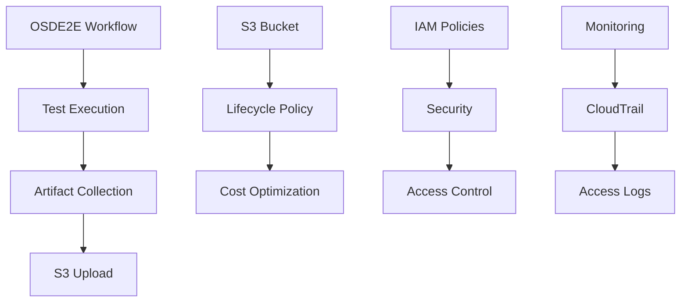

# S3 Artifact Repository Complete Implementation Guide

## Overview

This guide provides a complete technical roadmap and implementation steps for configuring AWS S3 as an Artifact Repository for OSDE2E workflows, enabling persistent storage of JUnit reports, HTML reports, and logs.

## Architecture Design

### Deterministic Storage Architecture (Optimized)

#### New Storage Structure
```
S3 Bucket: osde2e-test-artifacts
└── workflows/
    └── {operator-name}/                    # Operator name (e.g: osd-example-operator)
        └── {cluster-id}/                   # Cluster ID (e.g: 2ktc30g984vfcninfhgbd5ok1tn5e2b5)
            └── {timestamp}/                # Timestamp (e.g: 20250826-1530)
                ├── artifacts/              # Test artifacts directory
                │   ├── osde2e-reports.tar.gz      # Complete test report archive
                │   ├── main_execution.log          # Full execution log (direct view)
                │   └── test_output.log             # OSDE2E internal log (direct view)
                ├── test-summary.json       # Test summary (direct view)
                └── test-report.html        # HTML report (direct view)
```

#### Architecture Improvement History

**Previous Architecture (Deprecated)**:
```
S3 Bucket: osde2e-test-artifacts
└── 2024/01/15/
    └── osde2e-workflow-abc123/              # Random workflow name
        ├── osde2e-workflow-abc123-run-osde2e-test-1234567890/  # Random pod name
        │   ├── junit-reports.tar.gz
        │   └── ...
        └── osde2e-workflow-abc123-collect-test-results-9876543210/
```

**Issues:**
- ❌ Contains randomly generated workflow and pod names
- ❌ URLs contain wildcards (`*`), cannot be directly accessed
- ❌ Complex path structure, difficult to navigate

**New Architecture Advantages:**
- ✅ **Deterministic Paths**: Predictable paths based on operator, cluster, and timestamp
- ✅ **Easy Navigation**: Organized by operator and cluster for easy history lookup
- ✅ **No Wildcards**: All links are directly accessible without dynamic resolution
- ✅ **Simplified Structure**: Reduced nesting levels, improved readability
- ✅ **Direct Viewing**: Logs and report files can be viewed directly in browser without download

### Component Architecture


## Implementation Steps

### Step 1: Environment Preparation

#### 1.1 Check Prerequisites
```bash
# Check required tools
kubectl version --client
aws --version
jq --version

# Check AWS credentials
aws sts get-caller-identity

# Check Kubernetes connection
kubectl cluster-info
```

#### 1.2 Set Environment Variables
```bash
export S3_BUCKET_NAME="osde2e-test-artifacts"
export S3_REGION="us-east-1"
export AWS_ACCOUNT_ID=$(aws sts get-caller-identity --query Account --output text)
```

### Step 2: Security Configuration

#### 2.1 Create Credentials File
```bash
# Create secrets.yaml from template
cp secrets-template.yaml secrets.yaml

# Edit credentials (use secure editor)
vim secrets.yaml
```

#### 2.2 Verify .gitignore
```bash
# Ensure secrets.yaml won't be committed
echo "secrets.yaml" >> .gitignore
git status  # Confirm secrets.yaml is ignored
```

### Step 3: AWS Infrastructure Setup

#### 3.1 Automated Setup (Recommended)
```bash
# Run automated setup script
./setup-s3-artifacts.sh

# Or specify custom parameters
./setup-s3-artifacts.sh --bucket my-custom-bucket --region us-west-2

# For cross-account access
./setup-s3-artifacts.sh --cross-account
```

#### 3.2 Manual Setup (Optional)

**Create S3 Bucket:**
```bash
# Create bucket
aws s3api create-bucket \
    --bucket osde2e-test-artifacts \
    --region us-east-1

# Enable versioning
aws s3api put-bucket-versioning \
    --bucket osde2e-test-artifacts \
    --versioning-configuration Status=Enabled

# Configure encryption
aws s3api put-bucket-encryption \
    --bucket osde2e-test-artifacts \
    --server-side-encryption-configuration '{
        "Rules": [{
            "ApplyServerSideEncryptionByDefault": {
                "SSEAlgorithm": "AES256"
            }
        }]
    }'
```

**Apply Lifecycle Policy:**
```bash
cat > lifecycle-policy.json <<EOF
{
    "Rules": [{
        "ID": "OSDE2E-Artifacts-Lifecycle",
        "Status": "Enabled",
        "Transitions": [
            {
                "Days": 30,
                "StorageClass": "STANDARD_IA"
            },
            {
                "Days": 90,
                "StorageClass": "GLACIER"
            },
            {
                "Days": 365,
                "StorageClass": "DEEP_ARCHIVE"
            }
        ]
    }]
}
EOF

aws s3api put-bucket-lifecycle-configuration \
    --bucket osde2e-test-artifacts \
    --lifecycle-configuration file://lifecycle-policy.json
```

### Step 4: Kubernetes Resource Deployment

#### 4.1 Deploy Configuration Files
```bash
# Apply S3 configuration
kubectl apply -f s3-artifact-config.yaml

# Apply credentials
kubectl apply -f secrets.yaml

# Verify deployment
kubectl get configmap artifact-repositories -n argo -o yaml
kubectl get secret s3-artifact-credentials -n argo
```

#### 4.2 Configure Argo Workflows
```bash
# Update workflow-controller configuration
kubectl patch configmap workflow-controller-configmap -n argo --type merge -p '{
    "data": {
        "artifactRepository": "default"
    }
}'

# Restart workflow-controller
kubectl rollout restart deployment workflow-controller -n argo
```

### Step 5: Workflow Updates

#### 5.1 Deploy Updated Workflow
```bash
# Apply updated workflow template
kubectl apply -f osde2e-workflow.yaml

# Verify template
kubectl get workflowtemplate osde2e-workflow -n argo -o yaml
```

#### 5.2 Test Artifact Collection
```bash
# Run test workflow
./run.sh

# Or submit manually
argo submit --from workflowtemplate/osde2e-workflow -n argo \
    -p operator-image="quay.io/rh_ee_yiqzhang/osd-example-operator:latest" \
    -p test-harness-image="quay.io/rmundhe_oc/osd-example-operator-e2e:dc5b857"
```

## Verification and Testing

### Verify S3 Configuration
```bash
# Check bucket access
aws s3 ls s3://osde2e-test-artifacts/

# Test upload
echo "test" | aws s3 cp - s3://osde2e-test-artifacts/test.txt
aws s3 rm s3://osde2e-test-artifacts/test.txt
```

### Verify Kubernetes Configuration
```bash
# Check secrets
kubectl get secret s3-artifact-credentials -n argo -o jsonpath='{.data}' | base64 -d

# Check configmap
kubectl get configmap artifact-repositories -n argo -o yaml

# Check workflow controller configuration
kubectl get configmap workflow-controller-configmap -n argo -o yaml
```

### Verify Workflow Execution
```bash
# View workflow status
kubectl get workflows -n argo

# View artifact output
argo logs test-s3-artifacts -n argo

# Check artifacts in S3
aws s3 ls s3://osde2e-test-artifacts/ --recursive
```

## 📊 Artifact Management

### Using Management Scripts
```bash
# List all artifacts
./manage-s3-artifacts.sh list

# View specific workflow details
./manage-s3-artifacts.sh details osde2e-workflow-abc123

# Download artifacts
./manage-s3-artifacts.sh download osde2e-workflow-abc123

# Generate download links
./manage-s3-artifacts.sh urls osde2e-workflow-abc123

# Clean up old artifacts
./manage-s3-artifacts.sh cleanup 90

# View storage statistics
./manage-s3-artifacts.sh stats
```

### Manual Management
```bash
# Download specific artifact
aws s3 cp s3://osde2e-test-artifacts/workflows/operator/cluster/timestamp/artifacts/osde2e-reports.tar.gz ./

# Extract and view
tar -xzf osde2e-reports.tar.gz

# Batch download
aws s3 sync s3://osde2e-test-artifacts/workflows/operator/cluster/timestamp/ ./artifacts/
```

## 💰 Cost Optimization

### Storage Class Transitions
```
Standard (0-30 days):     $0.023/GB/month
Standard-IA (30-90 days): $0.0125/GB/month
Glacier (90-365 days):    $0.004/GB/month
Deep Archive (365+ days): $0.00099/GB/month
```

### Cost Estimation
```bash
# Calculate current storage cost
./manage-s3-artifacts.sh stats

# Example: 100GB data monthly cost
# Standard: $2.30
# Standard-IA: $1.25
# Glacier: $0.40
# Deep Archive: $0.099
```

### Optimization Recommendations
1. **Automated Cleanup**: Set 365-day deletion policy
2. **Compress Artifacts**: Use tar.gz to reduce storage space
3. **Selective Storage**: Only keep important test results
4. **Region Selection**: Use nearest AWS region

## Troubleshooting

### Common Issues

#### 1. AccessDenied Error
```bash
# Check IAM permissions
aws iam simulate-principal-policy \
    --policy-source-arn arn:aws:iam::$AWS_ACCOUNT_ID:user/your-user \
    --action-names s3:PutObject s3:GetObject \
    --resource-arns arn:aws:s3:::osde2e-test-artifacts/*

# Check bucket policy
aws s3api get-bucket-policy --bucket osde2e-test-artifacts
```

#### 2. Artifacts Not Uploaded
```bash
# Check workflow logs
kubectl logs -l app=osde2e-workflow -n argo

# Check artifact configuration
kubectl get workflowtemplate osde2e-workflow -n argo -o yaml | grep -A 20 artifacts

# Check controller configuration
kubectl get configmap workflow-controller-configmap -n argo -o yaml
```

#### 3. Credential Issues
```bash
# Verify secret
kubectl get secret s3-artifact-credentials -n argo -o yaml

# Test credentials
export AWS_ACCESS_KEY_ID=$(kubectl get secret s3-artifact-credentials -n argo -o jsonpath='{.data.accesskey}' | base64 -d)
export AWS_SECRET_ACCESS_KEY=$(kubectl get secret s3-artifact-credentials -n argo -o jsonpath='{.data.secretkey}' | base64 -d)
aws sts get-caller-identity
```

### Debug Commands
```bash
# View detailed logs
kubectl logs -f deployment/workflow-controller -n argo

# Check events
kubectl get events -n argo --sort-by='.lastTimestamp'

# Describe workflow
kubectl describe workflow test-s3-artifacts -n argo
```

## 📈 Monitoring and Alerting

### CloudWatch Metrics
- S3 storage usage
- API request count
- Error rate
- Data transfer costs

### CloudTrail Events
```bash
# View S3 access logs
aws logs filter-log-events \
    --log-group-name CloudTrail/S3DataEvents \
    --filter-pattern '{ $.eventName = "PutObject" }'
```

### Kubernetes Monitoring
```bash
# Monitor workflow status
kubectl get workflows -n argo -w

# Monitor resource usage
kubectl top pods -n argo
```

## Related Links

- [AWS S3 Documentation](https://docs.aws.amazon.com/s3/)
- [Argo Workflows Artifacts](https://argoproj.github.io/argo-workflows/walk-through/artifacts/)
- [Kubernetes Secrets](https://kubernetes.io/docs/concepts/configuration/secret/)
- [OSDE2E Framework](https://github.com/openshift/osde2e)

## ✅ Checklist

### Pre-Deployment Checklist
- [ ] AWS credentials configured correctly
- [ ] Kubernetes cluster accessible
- [ ] Required tools installed
- [ ] secrets.yaml created and configured
- [ ] .gitignore includes secrets.yaml

### Post-Deployment Verification
- [ ] S3 bucket created successfully
- [ ] IAM policies applied correctly
- [ ] Kubernetes secrets deployed successfully
- [ ] Workflow controller configuration updated
- [ ] Test workflow runs successfully
- [ ] Artifacts successfully uploaded to S3

### Security Checklist
- [ ] Using minimal privilege IAM policies
- [ ] Bucket encryption enabled
- [ ] Credentials not committed to version control
- [ ] Regular access key rotation
- [ ] Monitoring for anomalous access

---

## 🎉 Summary

Through this guide, you have successfully configured:

1. ✅ **Secure Credential Management System** - Using templates and .gitignore to protect sensitive information
2. ✅ **Complete S3 Artifact Repository** - Automated storage and lifecycle management
3. ✅ **Enhanced OSDE2E Workflows** - Supporting JUnit, HTML reports, and log persistence
4. ✅ **Management and Monitoring Tools** - For artifact management and cost optimization
5. ✅ **Troubleshooting Guide** - Quick resolution of common issues

Your OSDE2E test results will now be automatically persisted to S3, supporting long-term storage, cost optimization, and convenient access!